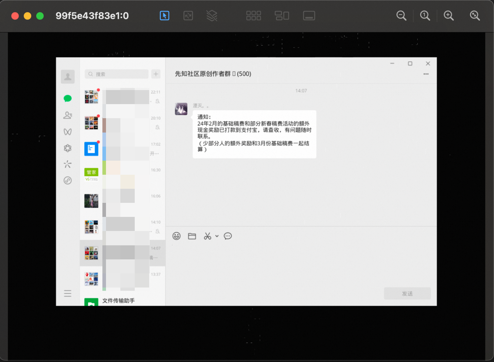

# Drag your Wechat to docker

WeChat in a Docker container.

## Build 

docker build  -t wxbot:linux  ./  

## RUN

docker run -d --rm  --name wxbot_linux  -p 5900:5900 wxbot:linux

## Connect

vnc://127.0.0.1:5900 
password: 123456

## images

1. connect

2. login

3. chat

